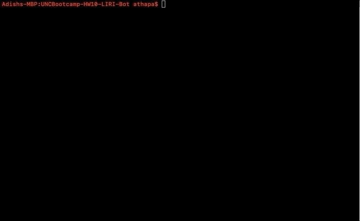

# UNCBootcamp-HW10-LIRI-Bot
UNC Coding Bootcamp HW 10 LIRI Bot

Language Interpretation and Recognition Interface (LIRI Bot) is a simple command line node application that takes in pre-defined parameters and gives you back data. It also logs the given command in log.txt.

Here are the parameters that the application accepts and their outputs:

* <strong>node liri.js concert-this &lt;artist/band name here></strong>
  * Outputs all of the upcomming concerts for the artist and the following information for them:
    * Venue name
    * Location (Country, City, and Region)
    * Date
  * Example:
  

  
  

* <strong>node liri.js movie-this &lt;movie name here></strong>
  * Outputs the following information for the movie:
    * Title
    * Released Year
    * IMDB Rating
    * Rotten Tomatoes Rating
    * Country
    * Languages
    * Actors
    * Plot
  * Example:
  

  
  

* <strong>node liri.js spotify-this-song &lt;song name here></strong>
  * Outputs up to 5 different songs with the name and the following information for them:
    * Song's name
    * Artists
    * Album
    * Preview
  * Example:
  

  
  

* <strong>node liri.js do-what-it-says</strong>
  * Reads data from random.txt and outputs information for them.
  * Example:
  

  
  

  * random.txt should be written like this:  
      &lt;any of the commands from above>,&lt;term to search for>  
      &lt;any of the commands from above>,&lt;term to search for>  
      ...  
      &lt;any of the commands from above>,&lt;term to search for>  
   * Example of a random.txt:  
     

     
     

<strong>After all of the command line arguments have been run from the examples above, the log.txt file should look like this:</strong>

